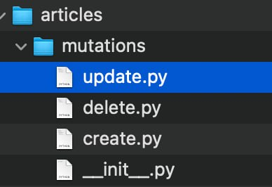

# Python Code Examples

APIViews example
view.py
```python
from django.http import JsonResponse

from rest_framework import status
from rest_framework.views import APIView
from rest_framework.response import Response

from drf_yasg import openapi
from drf_yasg.utils import swagger_auto_schema

from .serializers import AddressByXpubSerializer
from .serializers import GenerateWalletSerializer
from .serializers import MnemonicPrivateKeySerializer
from .serializers import DeleteTatumSubscriptionSerializer
from .serializers import ExchangeRateForCurrencySerializer
from .serializers import GenerateTatumSubscriptionSerializer

from .xcodes import AddressByXpubXcodeAutoSchema
from .xcodes import GenerateWalletXcodeAutoSchema
from .xcodes import BlockchainChoicesXcodeAutoSchema
from .xcodes import RemoveTatumSubscriptionXcodeAutoSchema
from .xcodes import GetPrivateKeyByMnemonicXcodeAutoSchema
from .xcodes import GenerateTatumSubscriptionXcodeAutoSchema
from .xcodes import GetExchangeRateForCurrencyXcodeAutoSchema

from .utils import generate_wallet, get_address_by_xpub, generate_tatum_subscription, remove_tatum_subscription, \
    generate_private_by_mnemonic, get_exchange_rate_for_currency

from .enums import Blockchain


class GenerateWallet(APIView):
    """
    API endpoint for generating a wallet.

    This endpoint allows the generation of a wallet for a specified blockchain.
    It expects a POST request with valid input data in the request body.

    Attributes:
        swagger_schema: An instance of the custom schema for Swagger documentation.

    Methods:
        post: Handles the POST request for generating a wallet.

    Example:
        To generate a wallet, make a POST request to this endpoint with the required data.
    """

    swagger_schema = GenerateWalletXcodeAutoSchema

    @swagger_auto_schema(
        operation_description="Generate a wallet",
        request_body=GenerateWalletSerializer,
        responses={
            201: openapi.Response('Created', content_type='application/json'),
            400: openapi.Response('Bad request', content_type='application/json'),
            500: openapi.Response("Internal Server Error", content_type="application/json"),
        },
    )
    def post(self, request):
        """
        Handle POST requests for generating a wallet.

        Args:
            request: The HTTP request object.

        Returns:
            Response: The HTTP response containing the generated wallet data or error messages.
        """
        serializer = GenerateWalletSerializer(data=request.data)
        if serializer.is_valid():
            blockchain_name = serializer.validated_data['blockchain_name']

            data = generate_wallet(blockchain_name=blockchain_name.strip())
            data["blockchain_name"] = blockchain_name

            return Response({'wallet_data': data}, status=status.HTTP_201_CREATED, content_type='application/json')

        return Response(serializer.errors, status=status.HTTP_400_BAD_REQUEST)


class AddressByXpub(APIView):
    swagger_schema = AddressByXpubXcodeAutoSchema

    @swagger_auto_schema(
        operation_description="Generate a wallet",
        request_body=AddressByXpubSerializer,
        responses={
            201: openapi.Response('Created', content_type='application/json'),
            400: openapi.Response('Bad request', content_type='application/json'),
            500: openapi.Response("Internal Server Error", content_type="application/json"),
        },
    )
    def post(self, request):
        serializer = AddressByXpubSerializer(data=request.data)
        if serializer.is_valid():
            blockchain_name = serializer.validated_data['blockchain_name']
            xpub = serializer.validated_data['xpub']
            index = serializer.validated_data['index']

            address = get_address_by_xpub(blockchain=blockchain_name.strip(), xpub=xpub, index=index)

            return Response({'address': address}, status=status.HTTP_200_OK, content_type='application/json')

        return Response(serializer.errors, status=status.HTTP_400_BAD_REQUEST)


class GenerateTatumSubscription(APIView):
    swagger_schema = GenerateTatumSubscriptionXcodeAutoSchema

    @swagger_auto_schema(
        operation_description="Generate Tatum subscription",
        request_body=GenerateTatumSubscriptionSerializer,
        responses={
            201: openapi.Response('Created', content_type='application/json'),
            400: openapi.Response('Bad request', content_type='application/json'),
            500: openapi.Response("Internal Server Error", content_type="application/json"),
        },
    )
    def post(self, request):
        serializer = GenerateTatumSubscriptionSerializer(data=request.data)
        print(request.data)
        if serializer.is_valid():
            print(serializer.validated_data)
            address = serializer.validated_data['address']
            chain = serializer.validated_data['chain']
            subscription_type = serializer.validated_data['subscription_type']
            subscription_object = generate_tatum_subscription(address=address, chain=chain,
                                                              subscription_type=subscription_type)
            return Response({'subscription_data': subscription_object}, status=status.HTTP_201_CREATED,
                            content_type='application/json')

        return Response(serializer.errors, status=status.HTTP_400_BAD_REQUEST)


class RemoveTatumSubscription(APIView):
    swagger_schema = RemoveTatumSubscriptionXcodeAutoSchema

    @swagger_auto_schema(
        operation_description="Remove Tatum subscription",
        request_body=DeleteTatumSubscriptionSerializer,
        responses={
            200: openapi.Response('Success', content_type='application/json'),
            400: openapi.Response('Bad request', content_type='application/json'),
            500: openapi.Response("Internal Server Error", content_type="application/json"),
        },
    )
    def delete(self, request):
        serializer = DeleteTatumSubscriptionSerializer(data=request.data)
        if serializer.is_valid():
            subscription_id = serializer.validated_data['subscription_id']
            response = remove_tatum_subscription(subscription_id=subscription_id)
            return Response({'data': response}, status=status.HTTP_200_OK, content_type='application/json')

        return Response(serializer.errors, status=status.HTTP_400_BAD_REQUEST)


class MnemonicPrivateKey(APIView):
    swagger_schema = GetPrivateKeyByMnemonicXcodeAutoSchema

    @swagger_auto_schema(
        operation_description="Create Tatum subscription",
        request_body=MnemonicPrivateKeySerializer,
        responses={
            201: openapi.Response('Created', content_type='application/json'),
            400: openapi.Response('Bad request', content_type='application/json'),
            500: openapi.Response("Internal Server Error", content_type="application/json"),
        },
    )
    def post(self, request):
        serializer = MnemonicPrivateKeySerializer(data=request.data)
        if serializer.is_valid():
            mnemonic = serializer.validated_data['mnemonic']
            index = serializer.validated_data['index']

            private_key = generate_private_by_mnemonic(mnemonic=mnemonic, index=index)
            return Response({'private_key': private_key}, status=status.HTTP_200_OK,
                            content_type='application/json')
        return Response(serializer.errors, status=status.HTTP_400_BAD_REQUEST)


class GetExchangeRateForCurrency(APIView):
    swagger_schema = GetExchangeRateForCurrencyXcodeAutoSchema

    @swagger_auto_schema(
        operation_description="Get exchange rate for currency",
        request_body=ExchangeRateForCurrencySerializer,
        responses={
            201: openapi.Response('Success', content_type='application/json'),
            400: openapi.Response('Bad request', content_type='application/json'),
            500: openapi.Response("Internal Server Error", content_type="application/json"),
        },
    )
    def post(self, request):
        serializer = ExchangeRateForCurrencySerializer(data=request.data)
        if serializer.is_valid():
            crypto_symbol = serializer.validated_data['crypto_symbol']
            fiat_symbol = serializer.validated_data['crypto_symbol']
            exchange_rate = get_exchange_rate_for_currency(crypto_symbol=crypto_symbol, fiat_symbol=fiat_symbol)
            return Response({'exchange_rate': exchange_rate}, status=status.HTTP_200_OK,
                            content_type='application/json')
        return Response(serializer.errors, status=status.HTTP_400_BAD_REQUEST)


class BlockchainChoicesAPIView(APIView):
    swagger_schema = BlockchainChoicesXcodeAutoSchema

    def get(self, request):
        choices = [choice[0] for choice in Blockchain.choices]
        return JsonResponse({'blockchain_choices': choices})
```

Model example

```python
from django.db import models
from django.utils.html import format_html

from sorl.thumbnail import get_thumbnail
from ckeditor_uploader.fields import RichTextUploadingField

from parler.models import TranslatableModel, TranslatedFields

from core.models import BaseModel
from core.models import BaseStatusModel
from core.models import BaseTimestampedModel

from ..utils import article_directory_path


class Article(BaseTimestampedModel, BaseStatusModel, BaseModel, TranslatableModel):
    """
        A class used to represent an Article model objects
        ...

        Attributes
        ----------
        title : str;
            string that represent a title for current article
        day_of_week : date;
            Date field that represent a day of week for current article
        content_type : str;
            string that represent a month when current card expires
        week : week;
            week object relation
        week_day_category : week_day;
            week_day_category object relation
        week_day : str;
            week_day object relation
        youtube_link : str;
            string that represent a YouTube link for current card

    """

    class Meta:
        app_label = "articles"
        verbose_name = 'Article'
        verbose_name_plural = 'Articles'

    week = models.ForeignKey('articles.Week', models.SET_NULL, blank=True, null=True)
    week_day_category = models.ForeignKey('articles.WeekDayCategories', models.SET_NULL, blank=True, null=True)
    week_day = models.ForeignKey('articles.WeekDays', on_delete=models.SET_NULL, blank=True, null=True)
    category = models.ForeignKey('articles.Categories', on_delete=models.SET_NULL, blank=True, null=True)
    day_of_week = models.DateField(null=True)
    content_type = models.IntegerField(null=True, blank=True)
    pdf = models.FileField(upload_to='uploads/% Y/% m/% d/', blank=True, null=True)
    cover_image = models.ImageField(upload_to=article_directory_path, blank=True, null=True)
    # chapter = models.CharField(max_length=255, blank=True, null=True)
    index = models.IntegerField(blank=True, null=True)

    translations = TranslatedFields(
        title=models.CharField(max_length=255),
        chapter=models.CharField(max_length=255, blank=True, null=True),
        text=RichTextUploadingField(blank=True, null=True),
        meta_obj=models.CharField(max_length=255, blank=True, null=True)
    )

    def __str__(self):
        return f"{self.title}"

    @property
    def avatar_preview(self) -> str:
        if self.cover_image:
            _cover_image = get_thumbnail(self.cover_image,
                                         '50x50',
                                         upscale=False,
                                         crop=False,
                                         quality=100)
            return format_html(
                ''.format(_cover_image.url, _cover_image.width,
                                                               _cover_image.height))
        return ""

    def get_app_list(self, request, app_label=None):
        app_dict = self._build_app_dict(request)
        app_list = sorted(app_dict.values(), key=lambda x: x['name'].lower())
        return app_list


class WeekDays(BaseTimestampedModel, BaseStatusModel, BaseModel, models.Model):
    """
           A class used to represent an Article model objects
           ...

           Attributes
           ----------
           week : week;
               week object relation
           date : date;
               Date field that represent a date object

            Methods
            -------
            get_all_related_article_objects(self)
                Returns a list of users who have an association with the current level object

       """
    week = models.ForeignKey('articles.Week', models.SET_NULL, blank=True, null=True)
    date = models.DateField(blank=True, null=True)
    created_at = models.DateTimeField()
    updated_at = models.DateTimeField()

    class Meta:
        app_label = "articles"
        verbose_name = 'WeekDay'
        verbose_name_plural = 'WeekDays'

    def get_all_related_article_objects(self) -> list:
        """Returns a list of articles which have an association with the current WeekDay object.

               Parameters
               ----------
                   self : instance
                       Instance of current age object

               Returns
               -------
                   list
                       generated PaymentMethods list
        """
        all_articles_with_week_day = [article for article in
                                      Article.objects.prefetch_related("week_day") if article.week_day]
        return [payment_method for payment_method in all_articles_with_week_day if payment_method.week_day is self]


class Categories(TranslatableModel):
    """
               A class used to represent a Categories model objects
               ...

               Attributes
               ----------
               name : str;
                   string that represent name of current category
           """

    translations = TranslatedFields(
        name=models.CharField(max_length=255, blank=True, null=True),
        created_at=models.DateTimeField(),
        updated_at=models.DateTimeField()
    )

    class Meta:
        app_label = "articles"
        verbose_name = 'Category'
        verbose_name_plural = 'Categories'

    def __str__(self):
        return f"{self.name}"


class WeekDayCategories(TranslatableModel):
    """
              A class used to represent an WeekDayCategories model objects
              ...

              Attributes
              ----------
              week_day : WeekDays;
                  week_day object relation
              category : Categories;
                  category object relation

               Methods
               -------
               get_all_related_article_objects(self)
                   Returns a list of users who have an association with the current level object

          """
    week_day = models.ForeignKey('articles.WeekDays', models.SET_NULL, blank=True, null=True)
    category = models.ForeignKey(Categories, models.SET_NULL, blank=True, null=True)
    created_at = models.DateTimeField()
    updated_at = models.DateTimeField()
    protected = models.BooleanField()
    translations = TranslatedFields(
        name=models.CharField(max_length=255, blank=True, null=True),
    )

    class Meta:
        app_label = "articles"
        verbose_name = 'WeekDayCategory'
        verbose_name_plural = 'WeekDayCategories'

    def __str__(self):
        return f"{self.name}"


class DefaultCategories(BaseTimestampedModel, BaseStatusModel, BaseModel, TranslatableModel):
    id = models.BigAutoField(primary_key=True)
    protected = models.BooleanField()

    translations = TranslatedFields(
        name=models.CharField(max_length=255),
    )

    class Meta:
        app_label = "articles"
        verbose_name = 'DefaultCategories'
        verbose_name_plural = 'DefaultCategories'

    def __str__(self):
        return f"{self.name}"


class Week(BaseTimestampedModel, BaseStatusModel, BaseModel, TranslatableModel):
    """
                  A class used to represent an Week model objects
                  ...

                  Attributes
                  ----------
                  title : str;
                      string that represent the title of current week object
                  start_date : DateField;
                      date_field that represent start of the week

                  due_date : DateField;
                      date_field that represent due date of the week

                   Methods
                   -------
                   get_all_related_article_objects(self)
                       Returns a list of users who have an association with the current level object

              """
    start_date = models.DateField(blank=True, null=True)
    due_date = models.DateField(blank=True, null=True)
    default_category = models.ForeignKey(DefaultCategories, models.SET_NULL, blank=True, null=True)

    translations = TranslatedFields(
        title=models.CharField(max_length=255, blank=True, null=True),
    )

    class Meta:
        app_label = "articles"
        verbose_name = 'Week'
        verbose_name_plural = 'Weeks'

    def __str__(self):
        return f"{self.title}"

    def get_all_related_article_objects(self) -> list:
        """Returns a list of articles which have an association with the current Week object.

               Parameters
               ----------
                   self : instance
                       Instance of current age object

               Returns
               -------
                   list
                       generated PaymentMethods list
        """
        all_articles_with_week = [article for article in
                                  Article.objects.prefetch_related("week") if article.week]
        return [payment_method for payment_method in all_articles_with_week if payment_method.week is self]
```

Graphqls Types example

```python

import json
import graphene
from graphene import ObjectType
from graphene_django import DjangoObjectType

from django.db.models import Q

from auth_custom.types import UserType
from auth_custom.models import CustomUser
from core.schema_helper import get_donate_on_by_info

from .models import Card
from .models import Paypal
from .models import SystemPayment
from .models import PaymentMethods
from .models import Donation
from .models import DonationGoal
from .models import DonationPlan


class CardType(DjangoObjectType):
    class Meta:
        model = Card
        fields = ("id", "card_number", "cardholder_name", "expires_month", "expires_year", "bank_name", "created_at",
                  "updated_at", "is_active")


class PaypalType(DjangoObjectType):
    class Meta:
        model = Paypal
        fields = ("id", "first_name", "last_name", "business", "address_line_1", "address_line_2", "city", "postcode",
                  "mobile_number", "email_address", "created_at", "updated_at", "is_active")


class SystemPaymentType(DjangoObjectType):
    class Meta:
        model = SystemPayment
        fields = ("id", "apple_pay_info", "google_pay_info", "created_at", "updated_at", "is_active",)


class PaymentMethodsType(DjangoObjectType):
    id = graphene.ID()
    card = graphene.Field(CardType)
    paypal = graphene.Field(PaypalType)
    system_payment = graphene.Field(SystemPaymentType)
    primary_method = graphene.String()
    monthly_donate = graphene.String()

    class Meta:
        model = PaymentMethods

    def resolve_card(self, info):
        return self.card

    def resolve_paypal(self, info):
        return self.paypal

    def resolve_system_payment(self, info):
        return self.system_payment


class DonationType(DjangoObjectType):
    class Meta:
        model = Donation


class DonationGoalType(DjangoObjectType):
    class Meta:
        model = DonationGoal


class DonationPlanType(DjangoObjectType):
    class Meta:
        model = DonationPlan


class TopType(ObjectType):
    user = graphene.Field(UserType)
    amount = graphene.Field(graphene.Float)

    class Meta:
        model = Donation


class DonationHistoryType(ObjectType):
    total = graphene.Float()
    top = graphene.List(TopType)

    def resolve_top(self, info):
        enum_key = get_donate_on_by_info(info)

        top_response_list = []
        donation_for_current_donate_on = Donation.objects.filter(donate_on=enum_key).order_by('-amount')

        for donation_object in donation_for_current_donate_on:
            donation_object = Donation.objects.filter(donate_on=enum_key).exclude(
                user_id__in=[top_response.user for top_response in top_response_list]).order_by('-amount').first()
            if donation_object:
                top_response_list.append(TopType(user=donation_object.user_id, amount=donation_object.amount))
        return top_response_list

    def resolve_total(self, info, **args):
        enum_key = get_donate_on_by_info(info)

        donation_objects = Donation.objects.filter(donate_on=enum_key)
        users = [donation.user_id for donation in donation_objects]
        return len(set(users))
```
Storing mutations

